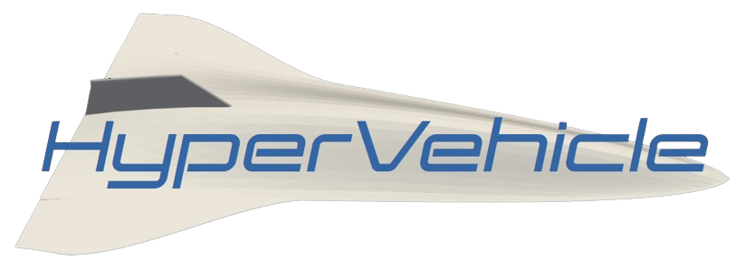

[](docs/hangar.md)

<p align="center">
  
  <a href="https://pypi.org/project/hypervehicle/">
    
  </a>
  
  <a href="https://github.com/psf/black">
    
  </a>

  <a href="https://kieran-mackle.github.io/hypervehicle/pytest_report">
    
  </a>

  <a href="https://kieran-mackle.github.io/hypervehicle/coverage">
    
  </a>
  
</p>

A Python package to rapidly generate parametric geometries
defined by hyperpatches. Check out the 
[hangar](docs/source/hangar.md) for some examples.


## Installation

To install `hypervehicle` from [PyPI](https://pypi.org/project/hypervehicle/), use the command below.

```
pip install hypervehicle
```

### Developing HyperVehicle
Contributions to HyperVehicle are welcome. Please refer to the [contribution guidelines](https://hypervehicle.readthedocs.io/en/latest/other/contributing.html) for guidance.


## Citing HyperVehicle
If you use HyperVehicle in any published work, please cite it using the BibTex reference below.

```text
@inproceedings{Mackle2024,
  author    = {Mackle, Kieran and Jahn, Ingo},
  booktitle = {AIAA Science and Technology Forum and Exposition},
  title     = {Efficient and Flexible Methodology for the Aerodynamic Shape Optimisation of Hypersonic Vehicle Concepts in a High-Dimensional Design Space},
  year      = {2024},
}
```

## License
HyperVehicle is licensed under [GPLv3](COPYING).
