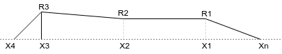
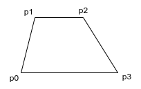

# HYPERVEHICLE Geometry Components

The *hypervehicle* package employs a component build up approach. 
There are three types of components: fuselage, wings and fins. 
Using these three component types, a wide range of geometries can 
be constructed. While there is an upfront cost associated with 
constructing a good parametric model, the generalised nature of 
*hypervehicle* allows you to programmatically define relationships 
between geometric components.

## TODO 
- document componet class and provide context of 
patches, meshes, surfaces, etc.

## Fuselage Components
A fuselage is defined using a series of axial coordinates and 
corresponding radii. This is shown in the schematic below. 

## Wing Components
A wing component is constructed by first defining the planform according to the points defined in
the schematic below.

Next, thickness is added to the wing using user-defined thickness functions. These function can 
be as simple as providing a constant thickness, or as complex ass providing 3-dimensionally varying
thickness.

A trailing-edge flap can easily be added to a wing component by defining the flap length and 
flap type. The flap angle can also be provided to deflect the flap.

## Fin Components

Fin components are very similar to wing components, but offer a few convenient options to assist 
in positioning. As with a wing, a fin is first defined by its planform according to the points 
shown below.

A rudder can also be added to the trailing-edge of a fin, producing something like that shown below.

To assist in fin positioning, the fin angle argument can be used to specify the angle of the fin, 
as rotated about the vehicles longitudinal (x) axis.

The pivot angle of the fin can also be controlled using the pivot angle argument. The pivot point
can also be specified.

