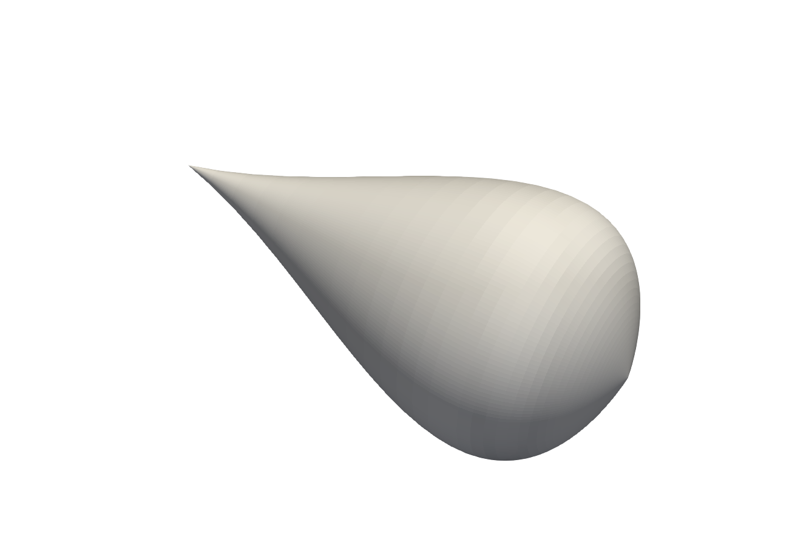
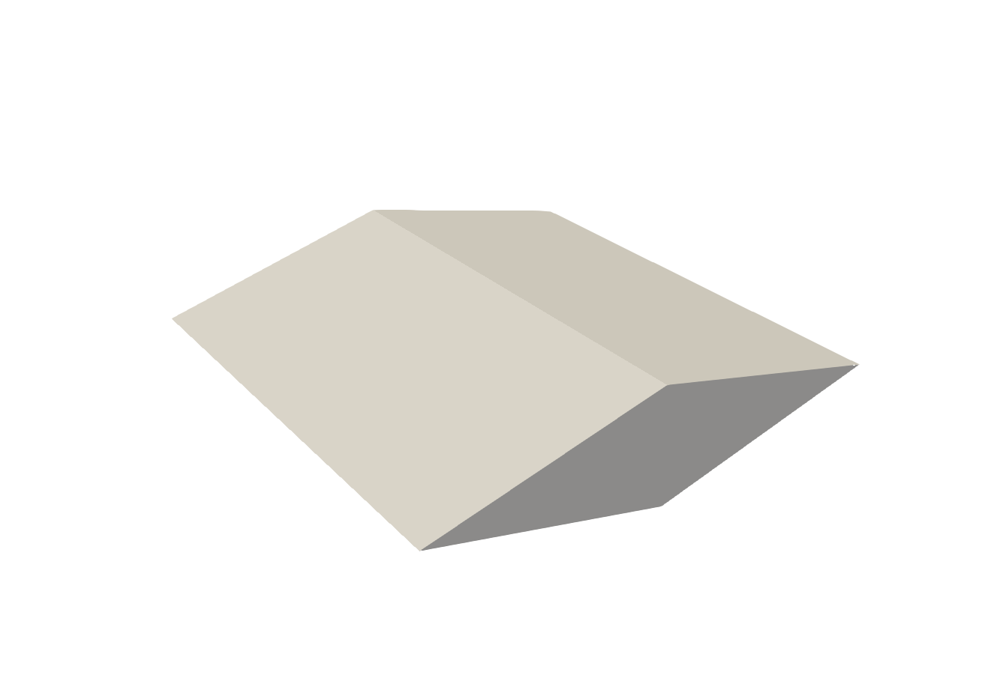
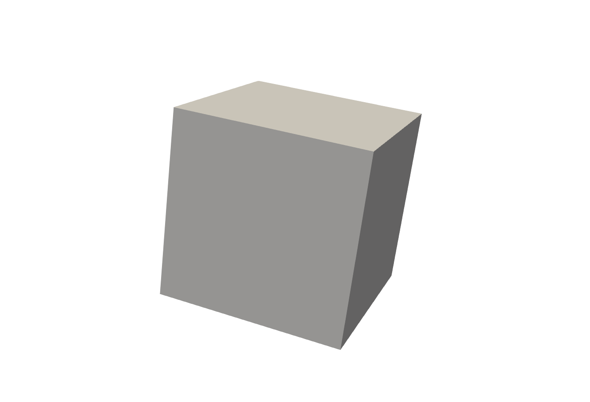
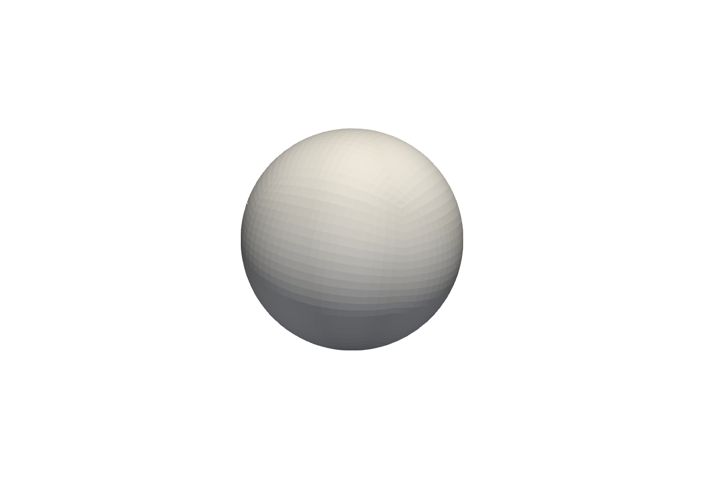

# Generic Component Types

The following page documents the generic component types of <tt>HyperVehicle</tt>. 
These are not vehicle-specific. Note that an example script is provided for each
component type in the <tt>HyperVehicle</tt> 
[examples](https://github.com/kieran-mackle/hypervehicle/blob/development/examples/)
directory.
<!-- [examples](https://github.com/kieran-mackle/hypervehicle/blob/master/examples/) -->

## Revolved Component
<!-- Example: [`revolved.py`](https://github.com/kieran-mackle/hypervehicle/blob/master/examples/components/revolved.py) -->
Example: [`revolved.py`](https://github.com/kieran-mackle/hypervehicle/blob/development/examples/components/revolved.py)

Revolved geometries can be constructed using the {py:class}`.RevolvedComponent`. 
This component is defined primarily by the line to be revolved.

## Swept Component
<!-- Example: [`swept.py`](https://github.com/kieran-mackle/hypervehicle/blob/master/examples/components/swept.py) -->
Example: [`swept.py`](https://github.com/kieran-mackle/hypervehicle/blob/development/examples/components/swept.py)

Swept geometries can be constructed using a {py:class}`.SweptComponent` type. This 
component requires a series of cross-sectional patches to be defined.

## Cube Component
<!-- Example: [`cube.py`](https://github.com/kieran-mackle/hypervehicle/blob/master/examples/components/cube.py) -->
Example: [`cube.py`](https://github.com/kieran-mackle/hypervehicle/blob/development/examples/components/cube.py)

A cube can be constructed via the {py:class}`.Cube` class. It only requires the cube side 
length to be provided.

## Sphere Component
<!-- Example: [`sphere.py`](https://github.com/kieran-mackle/hypervehicle/blob/master/examples/components/sphere.py) -->
Example: [`sphere.py`](https://github.com/kieran-mackle/hypervehicle/blob/development/examples/components/sphere.py)

A sphere can be constructed using the {py:class}`.Sphere` class. Like the cube, it 
only requires a radius to be defined.

## Composite Component
In some advanced instances, you may wish to combine the patches of various components 
into a single component. Or, you may have defined your own patch types. For this purpose,
the {py:class}`.CompositeComponent` class is available. This class allows a user to stack
individual {py:class}`.Component` objects to form a composite, which can then be added to
the {py:class}`.Vehicle`, for example.
