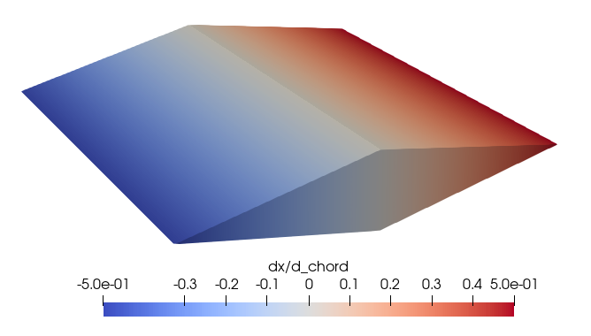
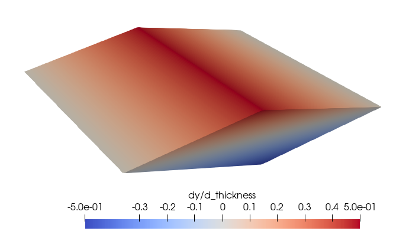
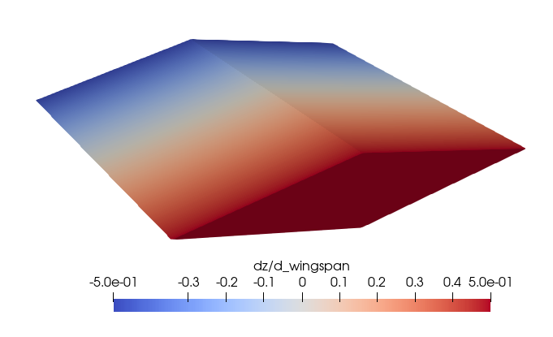

(sensitivities)=
# Generating Parameter Sensitvities
This tutorial will demonstrate how to generate geometric parameter
sensitivities using *hypervehicle*.

```{seealso}
This example follows on from the [sharp wedge](sharpwedge) tutorial.
```


## Workflow

### Nominal Geometry

First, create the nominal geometry configuration. For this example, 
we will be using the [sharp wedge](sharpwedge) geometry constructed
previously.


### Parametric Geometry Generator
The next step is to refactor the geometry generation code into a 
`Generator` object. This object inherits from the `AbstractGenerator`
object, shown below. This class has two methods: the `__init__` method,
where all geometric parameters are passed as arguments, and the 
`create_instance` method, which returns a [`Vehicle`](vehicle) object 
ready to be `generate`d.

```{eval-rst}
.. autoclass:: hypervehicle.generator.AbstractGenerator
```


The code below provides an example of this class. Note how the named kwargs 
are unpacked and overwrite the default parameters.


```python
from hypervehicle import Vehicle
from hypervehicle.components import Fuselage
from hypervehicle.generator import AbstractGenerator
from hypervehicle.geometry import Vector3, Line, CoonsPatch


class ParametricWedge(AbstractGenerator):
    def __init__(self, **kwargs) -> None:
        # Wedge parameters
        self.wingspan = 1
        self.chord = 1
        self.thickness = 0.1

        # Unpack kwargs (overwrites any params)
        for item in kwargs:
            setattr(self, item, kwargs[item])

    def create_instance(self) -> Vehicle:
        # Create vehicle object
        wedge = Vehicle()
        wedge.configure(name="Wedge", verbosity=1)

        # Define wedge cross-section points
        #                   ^ +y
        #                   |
        #            W    _ - _   N        ___
        #            _ -    |   - _         |
        #  +x <--- < -------------- >       | thickness
        #            - _    |   _ -         |
        #            S   -  _ -     E      ___
        #
        #          |-----------------|
        #                wingspan

        NW = Vector3(x=0, y=0.5 * self.thickness)
        NE = Vector3(
            x=-0.5 * self.chord,
            y=0,
        )
        SE = Vector3(x=0, y=-0.5 * self.thickness)
        SW = Vector3(x=0.5 * self.chord, y=0)

        # Define patches forming wedge
        sections = []
        for i in [-1, 1]:
            z_loc = 0.5 * i * self.wingspan
            axial_shift = Vector3(x=0, y=0, z=z_loc)

            N = Line(p0=NW + axial_shift, p1=NE + axial_shift)
            S = Line(p0=SW + axial_shift, p1=SE + axial_shift)
            E = Line(p0=SE + axial_shift, p1=NE + axial_shift)
            W = Line(p0=SW + axial_shift, p1=NW + axial_shift)

            patch = CoonsPatch(north=N, south=S, east=E, west=W)
            sections.append(patch)

        fuselage = Fuselage(
            cross_sections=sections,
            sweep_axis="z",
            stl_resolution=10,
        )
        wedge.add_component(fuselage)

        # Generate STL
        return wedge
```

Note that the nominal geometry could be generated using the generator
object as well:

```python
parametric_wedge_generator = ParametricWedge()
wedge = parametric_wedge_generator.create_instance()
wedge.generate()
```

This is a good check to ensure that the generator has been correctly
implemented.


### Run the Sensitivity Study
With the steps above completed, you can run a sensitivity study
by creating an instance of `hypervehicle.utilities.SensitivityStudy`.

Then, define the design parameters which you would like to get 
sensitivities to. In this example, we are extracting the geometric 
sensitivities to each wedge parameter: the thickness, the chord
and the wingspan. We specify this with the `parameters` dictionary,
passing along the nominal values to perturb about.

Finally, run the study by calling the `dvdp` method, passing in 
the design parameters.


```python
from hypervehicle.utilities import SensitivityStudy

# Construct sensitivity study
ss = SensitivityStudy(ParametricWedge)

# Define parameters to get sensitivities to
parameters = {'thickness': 0.1, 'chord': 1, 'wingspan': 1}

# Perform study
sensitivities = ss.dvdp(parameters)

# Save to CSV
ss.to_csv()
```

The output of `dvdp` is a nested dictionary, containing 
pandas `DataFrame`s for each parameter and component of the 
Vehicle object. 

You can also save the results of the study using the `to_csv` 
method. This will create a unique file for each component.


## Visualisation of Sensitivities

The `.csv` files can be opened in ParaView. After opening the file, 
select Table to Points (set `x`, `y` and `z` columns before applying), 
then Delaunay 3D filter.





