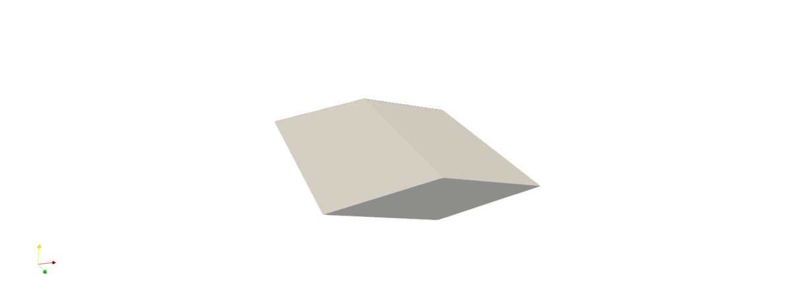

(sharpwedge)=
# Sharp Wedge Tutorial
This page provides a simple example to get started with <tt>HyperVehicle</tt>.
It will cover how to construct the sharp wedge shown below.

```{seealso}
The geometry developed in this example is also used in the 
[sensitivity tutorial](sensitivities).
```




## Parameters
Its a good idea to start a new geometry with an idea of the parameters
which will define it. For a simple geometry such as this, the wingspan,
chord length and thickness are the obvious choices.


```python
# Define geometry parameters
wingspan = 1
chord = 1
thickness = 0.1
```


## Swept Component
Since this geometry has a uniform cross-section, using a swept 
component is ideal.


```python
# Create vehicle object
wedge = Vehicle()
wedge.configure(name="Wedge", verbosity=1)

# Define wedge cross-section points
#                   ^ +y
#                   |
#            W    _ - _   N        ___
#            _ -    |   - _         |
#  +x <--- < -------------- >       | thickness
#            - _    |   _ -         |
#            S   -  _ -     E      ___
#
#          |-----------------|
#                wingspan

NW = Vector3(x=0, y=0.5 * self.thicknes)
NE = Vector3(
    x=-0.5 * self.chord,
    y=0,
)
SE = Vector3(x=0, y=-0.5 * self.thicknes)
SW = Vector3(x=0.5 * self.chord, y=0)

# Define patches forming wedge
sections = []
for i in [-1, 1]:
    z_loc = 0.5 * i * self.wingspan
    axial_shift = Vector3(x=0, y=0, z=z_loc)

    N = Line(p0=NW + axial_shift, p1=NE + axial_shift)
    S = Line(p0=SW + axial_shift, p1=SE + axial_shift)
    E = Line(p0=SE + axial_shift, p1=NE + axial_shift)
    W = Line(p0=SW + axial_shift, p1=NW + axial_shift)

    patch = CoonsPatch(north=N, south=S, east=E, west=W)
    sections.append(patch)

fuselage = Fuselage(
    cross_sections=sections,
    sweep_axis="z",
    stl_resolution=10,
)
wedge.add_component(fuselage)

# Generate
wedge.generate()
```


