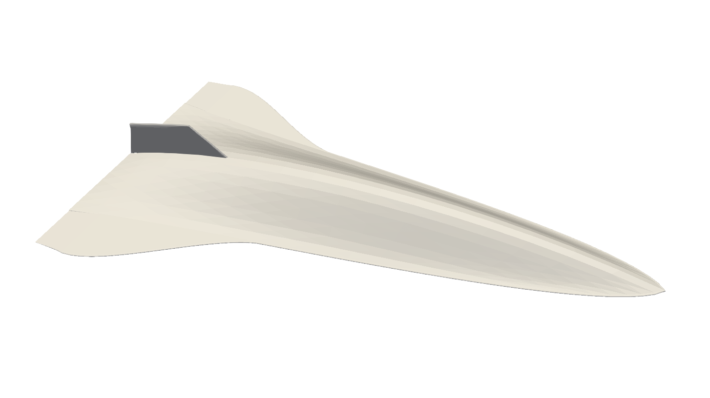

# Vehicle Hangar

This page is a showcase of vehicle geometries possible using *hypervehicle*.
Note that all of these vehicles can be accessed via the `hypervehicle.hangar`
namespace. For example, to generate the X-43A geometry shown below, the following
code can be used.

```python
from hypervehicle.hangar import ParametricX43

parametric_generator = ParametricX43()
x43 = parametric_generator.create_instance()
x43.generate()
x43.to_stl()
```

## Generic Hypersonic Waverider




## [X-43A](https://en.wikipedia.org/wiki/NASA_X-43)


## [HiFIRE4](https://www.dst.defence.gov.au/partnership/hifire-program)


## [HiFIRE8](https://www.dst.defence.gov.au/partnership/hifire-program)


## [Lockheed D-21](https://en.wikipedia.org/wiki/Lockheed_D-21)


## [DLR ReFEX](https://www.dlr.de/irs/en/desktopdefault.aspx/tabid-15435/#gallery/34117)


## [Hypersonic Technology Vehicle](https://en.wikipedia.org/wiki/Hypersonic_Technology_Vehicle_2)


## [SpaceX Falcon9](https://www.spacex.com/vehicles/falcon-9/)


## [Space Shuttle](https://en.wikipedia.org/wiki/Space_Shuttle)


