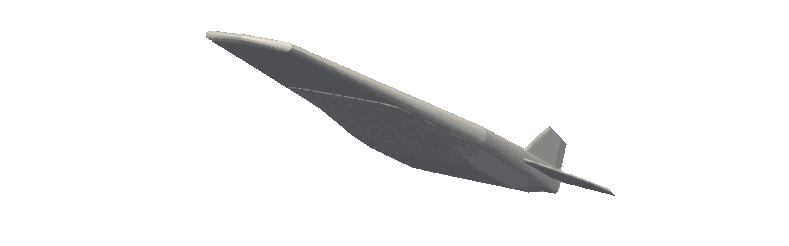

# hypervehicle documentation

```

▒█░▒█ █░░█ █▀▀█ █▀▀ █▀▀█ ▀█░█▀ █▀▀ █░░█ ░▀░ █▀▀ █░░ █▀▀ 
▒█▀▀█ █▄▄█ █░░█ █▀▀ █▄▄▀ ░█▄█░ █▀▀ █▀▀█ ▀█▀ █░░ █░░ █▀▀ 
▒█░▒█ ▄▄▄█ █▀▀▀ ▀▀▀ ▀░▀▀ ░░▀░░ ▀▀▀ ▀░░▀ ▀▀▀ ▀▀▀ ▀▀▀ ▀▀▀ 
 ✈                ✈                ✈                ✈ 
```

The *Hypervehicle* Python package provides a versatile tool to 
rapidly generate parametric vehicle geometries following a 
component build-up approach. Take a look at the 
[Getting Started](getting-started) guide to get set up, 
then have a look at the [examples](examples/x43).





```{toctree}
:maxdepth: 2
:hidden:
:caption: SHOWCASE

Vehicle Hangar <hangar>
```


```{toctree}
:maxdepth: 2
:hidden:
:caption: DOCUMENTATION

Getting Started <getting-started>
Component Definitions <documentation/components>
Sensitivities <documentation/sensitivity>
Contributing <documentation/contributing>
```


```{toctree}
:maxdepth: 2
:hidden:
:caption: TUTORIALS

Sharp Wedge <examples/wedge>
NASA X-43A <examples/x43>
Parameter Sensitivities <examples/sensitivity>
```


```{toctree}
:maxdepth: 2
:hidden:
:caption: API REFERENCE

Vehicle class <apiref/vehicle>
Components <apiref/component>
Changelog <apiref/changelog>
```


