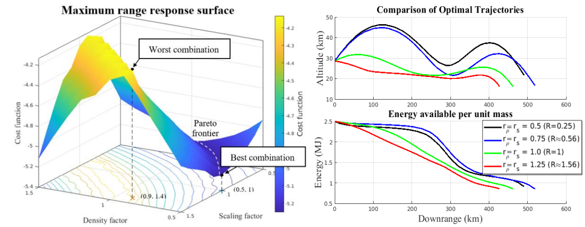

# 2022 Publications

## Co-Designing Hypersonic Vehicle Geometry and Trajectory

Published in: [23AFMC](https://www.afms.org.au/proceedings/23/Mackle_and_Jahn_2022.pdf)
<!-- https://www.afms.org.au/proceedings/23/Mackle_and_Jahn_2022.pdf -->

To address the hypersonic vehicle design challenge of highly integrated subsystems and
competing design requirements, a co-design approach is essential. This approach involves the
design and optimisation of various system components in parallel across an entire mission
trajectory, to obtain a vehicle configuration more optimal than any single trade study can produce.
In this paper, a parameterised mock-up of the X-43A is used as a baseline vehicle in a developed
co-design framework. By co-designing the vehicle geometry, parameterised as the vehicle’s mean
density and scale for a maximum range glide problem, a 15% increase in performance was
achieved. This increase in performance was attributed to the optimisation of the vehicle’s wing
loading and lift-to-drag ratio to suit a skip-glide trajectory. This paper therefore demonstrates the
capability of a co-design methodology to uncover the central performance-driving design features
under the influence of subsystem interactions. This adds value to the preliminary design stage,
highlighting underlying mission-critical design features.

