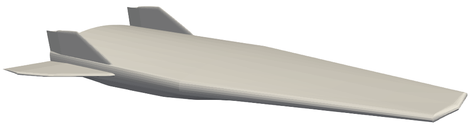
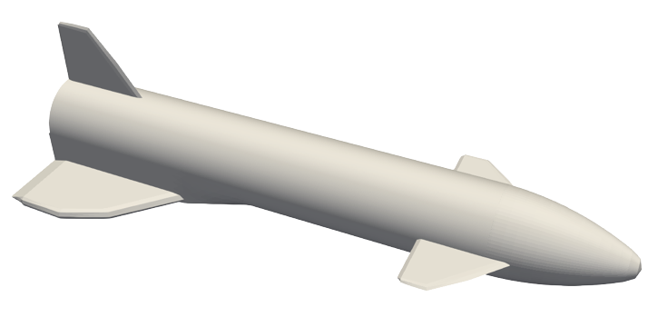

# Summary

HyperVehicle is a Python package for the rapid generation of component-based parametric geometries.
With a focus on hypersonic vehicle generation, a selection of vehicle-specific component constructors are provided for convenience.
More generic component types are also available, providing common CAD functions such as revolves and sweeps.
There are many more features available, such as geometry rotation and transformations, such as curvatures and scaling.

# Statement of need

Main reasons:
- open-source parameteric geometry engine in Python, focused on vehicle generation

{ width=50% }

{ width=50% }

{ width=50% }

# Acknowledgements

# References
