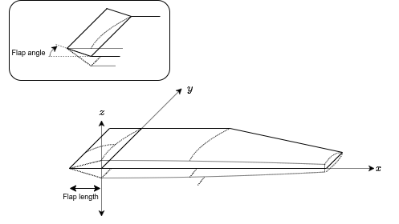
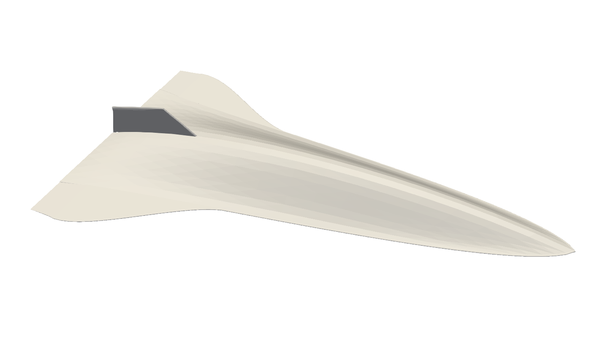

# Summary

HyperVehicle is a Python package for the rapid generation of component-based parametric geometries.
With a focus on hypersonic vehicle generation, a selection of vehicle-specific component constructors are provided for convenience.
More generic component types are also available, providing common CAD functions such as revolves and sweeps.
There are many more features available, such as geometry rotation and transformations, such as curvatures and scaling.

# Statement of need

An automated geometry generation tool lies at the heart of any design optimisation framework.
Without such a tool, design spaces cannot be efficiently explored to locate opimal designs.
**TODO** - discuss geometry generation options: CAD, etc.

While other Python-native geometry packages exist [@numpy_stl], they offer a low-level API for the general purpose of generating meshes from vertex coordinate and face IDs.
Other, more feature-rich packages also exist [@PyMesh], but **... Need to expand here and distinguish where hypervehicle sits.**
HyperVehicle differs from these packages in many ways.

As the name implies, HyperVehicle has a specific focus on the generation of vehicle geometries.
This focus is highlighted by the vehicle-specific component types provided, which act as templates for easily constructing a wide variety of vehicle geometries.
This does not mean that the package cannot be used for more general geometry generation purposes.
It also features all of the generic tools which are commonly found in a CAD software, but with the convenience and flexibility that Python affords, making it easy to integrate with.
Importantly, HyperVehicle also offers the capability to differentiate geometry with respect to design parameters, making it an extremely useful component of a gradient-based design optimisation framework.
This is exemplified in the hypersonic aerodynamics design and optimisation 
papers relying on HyperVehicle [@MackleAFMC, @MackleShapeOpt, @MackleCoDesign].

Similar frameworks appear abundantly throughout literature [@Bowcutt1992, @Bowcutt2001], yet there does not appear to be a publicly available library offering the required capabilities.
HyperVehicle aims to fill this gap, by providing an open-source, user-friendly and production-ready automated CAD tool as a Python package.

# Components
Below are some samples of the components available in HyperVehicle.

| Component type | Sample |
| -------------- | ------ |
| Swept          | {width=0.4%} |
| Revolved       | {width=0.4%} |
| Wing           | {width=0.4%} |

# Vehicle geometries
Below are some sample vehicle configurations generated using HyperVehicle.
Note that these geometries are made avaiable in the hypervehicle hangar.

   
   
  

# References
